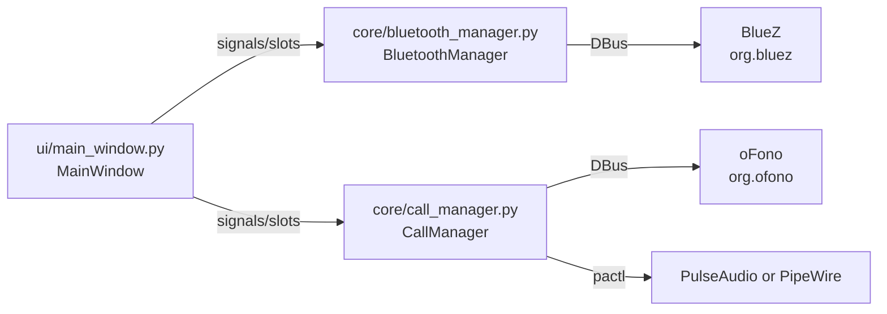

# BTCaller

BTCaller is a lightweight Linux desktop app that lets you place and receive phone calls over Bluetooth using a paired phone. It provides a simple dialer UI, incoming call screen, and basic audio routing controls.

## Features

- List paired Bluetooth devices and connect to one
- Dial a number and answer/reject incoming calls
- Simple in-call UI and call hangup
- Audio output selector (default sink)
- Automatic echo cancellation (WebRTC AEC) for the microphone during calls

## Requirements

### System

- Linux with BlueZ and DBus
- oFono (for telephony over Bluetooth)
- PulseAudio or PipeWire with `pactl`

### Python

- Python 3.9+ recommended
- PyQt6 (see requirements.txt)
- System packages for DBus and GLib introspection
	- Common package names: `python3-dbus`, `python3-gi`, `gir1.2-glib-2.0`

## Install

1. Ensure Bluetooth is working and your phone is paired using your system Bluetooth UI.
2. Install oFono and make sure the service is running.
3. Install Python dependencies:

```bash
python -m venv .venv
source .venv/bin/activate
pip install -r requirements.txt
```

## Run

```bash
python main.py
```

## Using guide

1. Click "Refresh Devices" to list paired devices.
2. Select your phone and click "Connect".
3. After connection, the app attempts to find an oFono modem automatically.
4. Enter a number and press "Call" to dial.
5. For incoming calls, use "Accept" or "Reject".
6. Use "Speaker / Audio Output" to pick a different output device.
7. End a call with "End Call".

## How it works

BTCaller uses the BlueZ DBus API to discover and connect to paired devices, and the oFono DBus API to manage voice calls. A GLib DBus main loop is installed before the Qt event loop so DBus signals (like call state changes) can be delivered to the UI.

During a call, BTCaller loads PulseAudio/PipeWire's `module-echo-cancel` to enable WebRTC echo cancellation and sets the default audio source to the clean virtual mic. When the call ends, it restores the original source and unloads the module.

## Core architecture



## Internal working

### Startup flow

1. `main.py` installs the GLib DBus main loop and starts the Qt application.
2. `MainWindow` is created with instances of `BluetoothManager` and `CallManager`.
3. The UI calls `refresh_devices()` to list paired devices.
4. `BluetoothManager.listen_for_changes()` subscribes to DBus property updates.

### Bluetooth device handling

- `BluetoothManager.get_paired_devices()` queries BlueZ via `ObjectManager` and returns only paired devices.
- `BluetoothManager.connect_device()` calls `org.bluez.Device1.Connect()` on the selected device.
- When BlueZ reports a connection change, `connection_status_changed` is emitted and the UI refreshes.

### Call handling

- `CallManager.find_modem()` finds the first oFono modem and powers it on if needed.
- `CallManager` listens to `CallAdded` and `CallRemoved` DBus signals.
- On incoming calls, the UI switches to the incoming call screen.
- On outgoing calls, the UI switches to the in-call screen.

### Echo cancellation and audio routing

- Before answering or when a call becomes active, `enable_echo_cancel()` loads `module-echo-cancel` and sets the default source to `btcaller_ec_mic`.
- When all calls end, `disable_echo_cancel()` restores the original source and unloads the module.
- The speaker menu lists sinks using `pactl list short sinks` and sets the default sink with `pactl set-default-sink`.

## Project layout

```
main.py
core/
	bluetooth_manager.py
	call_manager.py
ui/
	main_window.py
	style.py
```

## Troubleshooting

- No devices listed: make sure your phone is paired and BlueZ is running.
- Calls do not start: verify oFono is running and exposes a modem on DBus.
- No audio or echo: ensure `pactl` exists and PulseAudio or PipeWire is active.

## Notes and limitations

- Linux only (relies on BlueZ, oFono, and DBus).
- Uses the first modem reported by oFono.
- UI is a minimal example and does not display call duration yet.
