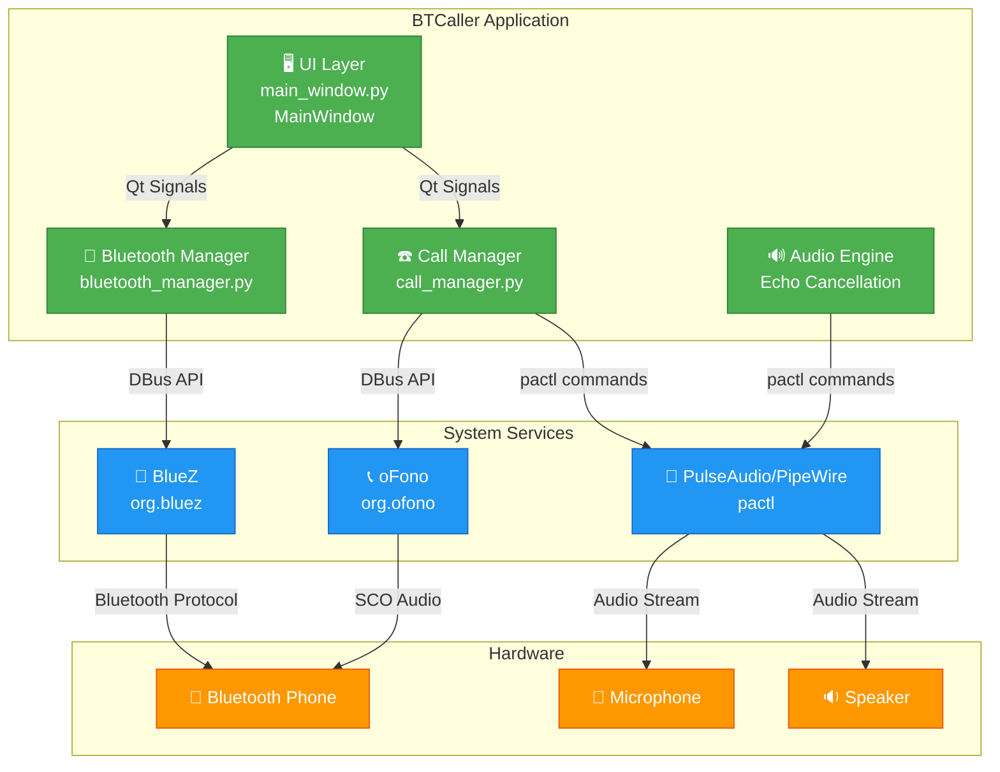
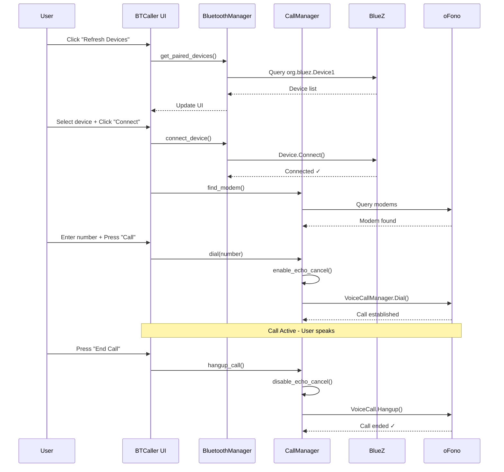
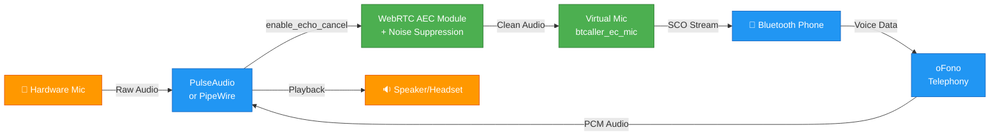

# 📱 BTCaller

> Make phone calls over Bluetooth from your Linux desktop without touching your phone!

**BTCaller** is a sleek, lightweight Linux desktop application that seamlessly bridges your paired smartphone and your computer, enabling you to place and receive phone calls directly from your desktop. No messy cables, no complex setups—just pure Bluetooth connectivity with crystal-clear audio thanks to built-in echo cancellation.

## ✨ Features at a Glance

| Feature | Description |
|---------|-------------|
| 📡 **Bluetooth Device Management** | List paired devices and connect with a single click |
| ☎️ **Dial & Answer** | Full calling capability—dial numbers, accept/reject incoming calls |
| 🎙️ **Call Controls** | Intuitive in-call UI with mute, audio output selection, and hangup |
| 🔊 **Audio Routing** | Switch between speakers, headsets, or any audio output on your system |
| 🎧 **Echo Cancellation** | WebRTC-powered automatic echo cancellation + noise suppression for pristine calls |

## 🔧 Requirements

### System Dependencies
```
✓ Linux OS with BlueZ & DBus
✓ oFono (telephony service)
✓ PulseAudio or PipeWire + pactl
```

**Install system packages:**
```bash
# Debian/Ubuntu
sudo apt install -y bluez ofono pulseaudio

# Or with PipeWire
sudo apt install -y bluez ofono pipewire-pulse
```

### Python Dependencies
```
✓ Python 3.9+ (3.11+ recommended)
✓ PyQt6
✓ python3-dbus
✓ python3-gi
✓ gir1.2-glib-2.0
```

## 🚀 Quick Start

### 1️⃣ Setup & Installation

```bash
# Clone the repository
git clone <your-repo-url>
cd BTCaller

# Create virtual environment
python3 -m venv .venv
source .venv/bin/activate  # On Windows: .venv\Scripts\activate

# Install dependencies
pip install -r requirements.txt
```

### 2️⃣ Prepare Your System

```bash
# Ensure Bluetooth is enabled
sudo systemctl start bluetooth
sudo systemctl start ofono

# Pair your phone via system Bluetooth settings
# Then run the app...
```

### 3️⃣ Launch the App

```bash
python main.py
```

### 4️⃣ Make Your First Call

1. 🔄 Click **"Refresh Devices"** to see your paired devices
2. 📱 Select your phone and click **"Connect"**
3. ⏳ Wait for the modem to initialize (auto-detected)
4. 🔢 Enter a number in the dialpad
5. 📞 Press **"Call"** and enjoy crystal-clear audio!

## 🏗️ Architecture

### System Architecture Diagram



### Call Flow Sequence



### Data Flow: Incoming Call

```mermaid
graph LR
    Phone["📱 Phone"] -->|DBus Signal| oFono["oFono<br/>CallAdded"]
    oFono -->|Qt Signal| CallMgr["CallManager<br/>incoming_call"]
    CallMgr -->|Qt Signal| UI["MainWindow<br/>on_incoming_call()"]
    UI -->|Switch Screen| IncScreen["Incoming Call Screen<br/>Shows caller ID"]
    User["👤 User"] -->|Click Accept| UI
    UI -->|answer_call()| CallMgr
    CallMgr -->|Enable AEC| Audio["🎧 Audio Engine"]
    CallMgr -->|Answer()| oFono
    oFono -->|SCO Audio| Phone
```

## 📁 Project Structure

```
BTCaller/
├── main.py                          # 🚀 Application entry point
├── requirements.txt                 # 📦 Dependencies
├── Readme.md                        # 📖 This file
│
├── core/                            # ⚙️ Core Logic
│   ├── __init__.py
│   ├── bluetooth_manager.py         # 📡 BlueZ DBus interface
│   └── call_manager.py              # ☎️ oFono DBus interface + Audio
│
└── ui/                              # 🎨 User Interface
    ├── __init__.py
    ├── main_window.py               # 🖥️ Main UI window
    └── style.py                     # 🎭 Dark theme stylesheet
```

### Key Components Explained

| File | Responsibility |
|------|-----------------|
| `main.py` | Initializes DBus mainloop, creates managers, launches UI |
| `bluetooth_manager.py` | Manages device discovery, connection/disconnection via BlueZ DBus API |
| `call_manager.py` | Handles calling, modem detection, echo cancellation via oFono DBus API |
| `main_window.py` | Qt6 UI with dashboard, dialpad, incoming/outgoing call screens |
| `style.py` | Modern dark theme with green/red call buttons |

## 🔍 How It Works

### The Magic Behind the Scenes ✨

BTCaller orchestrates seamless communication between your desktop and phone through three key technologies:

#### 1. **Bluetooth Discovery & Connection** 📡
- Uses **BlueZ DBus API** to enumerate paired devices
- Establishes Bluetooth connection to your phone
- Monitors connection state changes and updates the UI in real-time

#### 2. **Telephony Over Bluetooth** ☎️
- Leverages **oFono** (telephony daemon) to expose voice call management
- Manages call states: dialing, ringing, active, ended
- Supports multiple simultaneous calls (though typically just one per device)

#### 3. **Crystal-Clear Audio** 🎧
- **WebRTC Echo Cancellation** eliminates microphone feedback
- **Noise Suppression** removes background noise
- **Virtual Microphone** (`btcaller_ec_mic`) routes clean audio to the phone
- Automatically enabled/disabled per call lifecycle

### Startup Sequence

```
1. main.py starts
   ↓
2. Install GLib DBus main loop (required for DBus signal delivery)
   ↓
3. Create Qt application
   ↓
4. Instantiate BluetoothManager & CallManager
   ↓
5. Create MainWindow with managers
   ↓
6. UI calls refresh_devices() → queries BlueZ
   ↓
7. Listen for DBus signals (connection changes, incoming calls)
   ↓
8. Ready for user interaction! 🎉
```

### Audio Processing Pipeline



## 🛠️ Troubleshooting Guide

### ❌ Problem: No devices listed

**Cause:** Bluetooth service not running, phone not paired, or BlueZ DBus issue

**Solutions:**
```bash
# 1. Verify Bluetooth is running
sudo systemctl status bluetooth

# 2. Ensure phone is paired
bluetoothctl
# > devices (should list your phone)
# > info <MAC> (should show Paired: yes)

# 3. Check BlueZ service on DBus
dbus-send --print-reply --system /org/bluez / \
  org.freedesktop.DBus.ObjectManager.GetManagedObjects
```

### ❌ Problem: Calls do not start / "Modem not found"

**Cause:** oFono not running or phone not connected via Bluetooth first

**Solutions:**
```bash
# 1. Verify oFono is running
sudo systemctl status ofono

# 2. Check if modem is exposed on DBus
dbus-send --print-reply --system /org/ofono / \
  org.ofono.Manager.GetModems

# 3. Restart oFono
sudo systemctl restart ofono

# 4. Connection order: Pair → Connect via app → Then call
```

### ❌ Problem: No audio or echoing during calls

**Cause:** PulseAudio/PipeWire issue, AEC module not loading, or audio routing problem

**Solutions:**
```bash
# 1. Verify PulseAudio/PipeWire is running
pactl info

# 2. Test AEC module can be loaded
pactl load-module module-echo-cancel

# 3. Verify pactl command is available
which pactl

# 4. Check default source/sink
pactl get-default-source
pactl get-default-sink
```

### 🔍 Enable Debug Logging

```bash
# View DBus signals in real-time
DBUS_VERBOSE=1 python main.py 2>&1 | grep -i call

# Check system logs
journalctl -u bluetooth -u ofono -f
```

## 📋 Limitations & Notes

| Topic | Status |
|-------|--------|
| Platform | 🐧 **Linux only** (requires BlueZ, oFono, DBus) |
| Calls | ✓ Multiple modems (uses first one) |
| Call Duration | ⏱️ Not displayed yet (can be added) |
| Group Calls | ❌ Not tested |
| Conference Calls | ❌ Not implemented |
| Call History | ❌ Not logged |
| Contacts | ❌ Manual number entry only |
| Video | ❌ Voice only |

## 🚧 Future Enhancements

- [ ] Display call duration timer
- [ ] Call history/log
- [ ] Favorite numbers
- [ ] Phone contact sync
- [ ] Dark/Light theme toggle
- [ ] Call recording (where legal)
- [ ] Multiple device support
- [ ] Bluetooth reconnection handling

## 🤝 Contributing

Found a bug? Have an idea? Feel free to submit issues and pull requests!

## 📄 License

Check the LICENSE file in the repository.

---

<div align="center">

**Made with ❤️ for Linux enthusiasts**

*Connect to your phone. Place your calls. Stay focused on your desktop.* 📞✨

</div>
